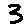

# Handwritten Digits Classifier

This project offers three different approaches to classify handwritten digits:

- **Using Numpy**: Numpy is used to compute the forward and backward passes of Multi-Layered Perceptrons(MLPs) network.
- **Using TensorFlow**: A Convolutional Neural Network (CNN) architecture is employed for classification.
- **Using PyTorch**: PyTorch will be used with a CNN architecture.

## Requirements
- Install all python packages by running `pip install -r requirements.txt`
- Install Node.js >= 14.x, npm, nvm
- Run `npm install`

## How to Use: 
There are 2 ways of using this application:
- As a web-app:
   1. Run `python inference_server.py`
   2. cd web-app
   3. Run `npm run dev` 

- From terminal:
   1. Run `draw_digit.py` with the chosen model:
      - `python draw_digit.py np` for the Numpy model.
      - `python draw_digit.py tf` for the TensorFlow model (default).
      - `python draw_digit.py pyt` for the pyTorch model.

   2. A "draw a digit here" dialogue box will appear.

   3. Draw a digit within the dialogue box.

   4. The predicted digit will be displayed in the terminal, and you'll hear an audio prompt of the digit.

   5. If needed, press 'r' to retry and draw another digit.